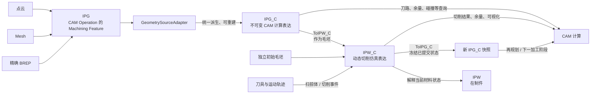
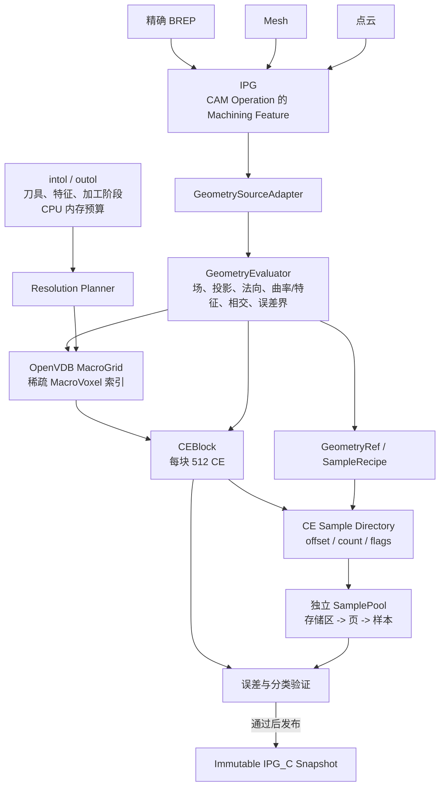
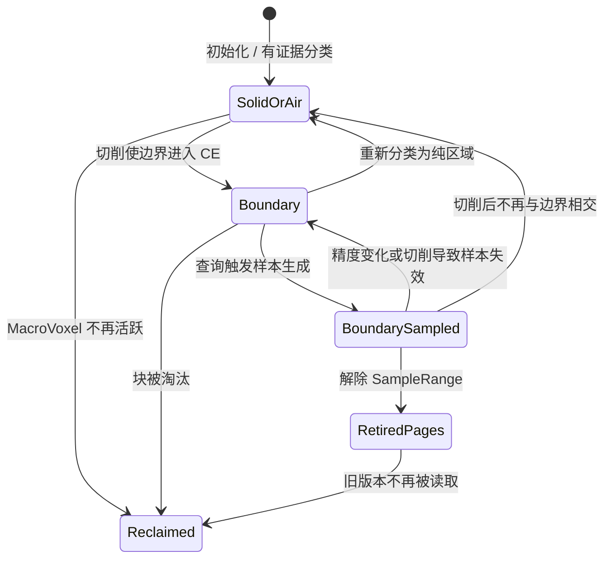

# IPG_C / IPW_C 计算表达设计报告

| 项目 | 内容 |
|---|---|
| 版本 | 0.b |
| 日期 | 2026-08-27 |
| 状态 | Draft for review |
| 范围 | IPG/IPG_C、IPW/IPW_C 的概念、输入归一化、双向转换、核心数据结构与算法决策 |

> 说明：本文将需求第 5 项中的 `IPW_W` 按上下文解释为 `IPW_C`。本文中的公式与参数是架构约束和规划依据；具体阈值必须通过基准模型、误差验证和性能测试标定。

## 关键设计决策

1. **IPG_C 是可按需细化、带误差说明的计算表达，不是单一几何结构。** Mesh、G-buffer、有符号距离场（SDF）、OpenVDB 树、CEBlock 和 SurfaceSample 都只是实现手段或缓存形态；IPG_C 的目标是服务 CAM 查询、误差检查、来源回查和大规模任务调度。
2. **多源几何统一适配，但不降级来源权威性。** 精确 BREP、Mesh 和点云均通过 `GeometrySourceAdapter` 进入统一查询契约；BREP 的精确查询能力不得被过早体素化丢弃，Mesh/点云的来源误差也不能被伪装成更高精度。
3. **推荐候选实现是稀疏空间索引 + CE 数据块 + 按需局部几何。** MacroGrid/CEBlock/SamplePool 是当前建议路径，但不是设计定义本身；固定 `8 x 8 x 8` CEBlock 只代表一个局部数据块的布局，不代表全局采用相同精度。
4. **CE 是保守分类、误差证明和样本归属的最小候选单元。** SurfaceSample 只允许属于 Boundary CE；但 Boundary CE 可以仅保留来源几何引用或重建配方，避免在极端规模下强制常驻海量点法样本。
5. **先实现 CPU 版本，再扩展 GPU。** 首版在 CPU 上完成构建、查询、误差检查和转换闭环。数据结构从一开始使用连续数组、显式位宽和索引，不保存跨设备指针；未来 GPU 读取按页组织的线性 CE 数据块，而不是直接遍历 OpenVDB 复杂树结构。
6. **IPG_C 静态、IPW_C 动态，但可在阶段边界双向转换。** IPG_C 可转为 IPW_C 并立即作为毛坯参与仿真；已提交的 IPW_C 也可冻结为新的 IPG_C，继续参与 CAM 计算。
7. **`intol/outol` 是硬约束，`voxelSize` 是内部决策。** 分辨率规划必须综合误差、曲率、最小特征、刀具、五轴姿态变化、加工阶段和内存预算；还应估算未来 GPU 的单批数据规模，不能只使用 `voxelSize = K * tolerance`。
8. **传统 Mesh/G-buffer 可作为派生缓存，不应作为统一 IPG_C 的权威表达。** 它们在特定投影、可视化、交换和局部加速中仍有价值，但在极端规模、自动精度、五轴通用查询和严格误差边界方面存在结构性限制。
9. **转换采用同构共享、异构重采样的混合策略。** 兼容布局共享只读页并在 IPW_C 首次写入时按块复制；不兼容布局在阶段切换时一次性重采样和验证，使转换后的 CAM 与仿真热路径不承担额外分支。

---

## 1. 核心概念与定义

### 1.1 四个顶层对象

| 概念 | 定义 | 权威性与生命周期 |
|---|---|---|
| **IPG** | In-Process Geometry，代表一个 CAM Operation 的加工目标（Machining Feature）及其加工语义。其几何来源通常是精确 BREP，少数情况下是 Mesh 或点云。 | 在当前 CAM Operation 内静态；在其已知精度和完备性范围内，是该加工目标的语义与来源真值。 |
| **IPG_C** | IPG Compute Representation，由 IPG 的 BREP、Mesh 或点云来源统一派生，面向 CAM 几何查询、可按需细化并记录误差范围的计算表达。它不限定为 Mesh、G-buffer、SDF 或 OpenVDB 树中的某一种结构。候选实现包括稀疏空间索引、CE 数据块、误差记录、来源几何引用、Machining Feature 绑定和按需 SurfaceSample。 | 不可变计算快照；可由 IPG 重建，也可由已提交的 IPW_C 转换生成。不是 IPG 或来源几何本身，也不替代来源几何的精度权威。 |
| **IPW** | In-Process Workpiece，某一加工时刻实际存在的在制件材料状态。 | 随切削演化；是物理对象的语义概念。 |
| **IPW_C** | IPW Compute Representation，用于生成、更新和查询 IPW 的切削仿真计算模型。可由独立毛坯或 IPG_C 初始化，以稀疏 CE 状态、局部场和切削历史表达材料变化。 | 动态；局部增量更新，是仿真中的当前计算状态；可在已提交 epoch 上转换为 IPG_C。 |



### 1.2 推荐候选空间层级

以下空间层级是当前建议的候选实现词汇，用于讨论数据布局和算法分工；它不是 IPG_C 的概念定义。若后续基准证明存在更合适的稀疏层级、局部数据块尺寸或 GPU 缓存布局，可以在保持同一查询契约和误差检查方式的前提下替换。

| 层级 | 核心职责 | 不承担的职责 |
|---|---|---|
| **MacroGrid** | 推荐以 OpenVDB 或等价稀疏结构作为空间目录；定位活跃 MacroVoxel，支持拓扑遍历、邻域查询和按块调度。 | 不直接存放海量 SurfaceSample 点法数据，也不作为未来 GPU 直接计算的数据布局。 |
| **MacroVoxel** | 候选的活跃空间块。对 Boundary 区域挂接一个 CEBlock，并作为 CPU 并行任务、缓存读写以及未来 CPU/GPU 传输的主要批次。 | 不是样本的最小语义所有者，也不要求全模型统一尺寸。 |
| **CEBlock** | 候选的局部数据块，一个 MacroVoxel 内可固定为 `8^3 = 512` 个 CE。固定局部布局有利于连续访问、CPU 向量化，以及未来映射到 GPU 线程组。 | 不形成独立 MicroGrid 数据层，也不代表全局均匀精度。 |
| **CE** | Computational Element，分类、误差证明、局部几何查询和 SurfaceSample 归属的最小计算单元。 | 不拥有独立堆分配；不必为每个 Boundary CE 常驻样本。 |
| **SurfaceSample** | 从 BREP、Mesh、点云重建边界或当前仿真边界按需派生的点法样本，用于接触、局部曲面重建或其他需要显式表面信息的算法。其可信度受来源误差限制。 | 不是权威几何；不应被强制要求在所有 Boundary CE 中常驻。 |

设 MacroVoxel 边长为 `V`，固定 CE 分辨率为 `8`，则 CE 边长：

```text
h = V / 8
```

CE 的稳定空间标识建议为：

```text
CEKey = (macroCoord.x, macroCoord.y, macroCoord.z, ceLocalId)
ceLocalId in [0, 511]
```

`ceLocalId` 可采用 Morton 顺序或固定线性顺序，但必须先在 CPU 内存和序列化格式中统一；未来 Metal 后端沿用同一编号。

### 1.3 CE 状态与有证据分类

CE 至少包含三种语义状态：

- `SOLID`：整个 CE 被证明位于材料内部；
- `AIR`：整个 CE 被证明位于材料外部；
- `BOUNDARY`：不能证明为纯 Solid/Air，或已确认与边界相交。

本文统一使用与 OpenVDB level set 一致的符号约定：

```text
phi(x) < 0  表示材料内部
phi(x) > 0  表示空气/材料外部
phi(x) = 0  表示边界
```

若来源适配器或历史实现采用相反符号，必须在 `GeometrySourceAdapter` 或进入 `GridSpec` 前一次性归一化；CE 状态判断、误差证明、布尔组合和缓存文件均以该 OpenVDB 符号约定为准。未来 GPU 计算函数也必须沿用此约定，不以既有代码的临时约定为准。

在 CE 中心 `c` 计算近似场值 `phi_hat(c)`，其保守误差上界为 `epsilon(c)`；立方 CE 的中心覆盖半径为：

```text
rho = sqrt(3) * h / 2
```

若场满足局部 1-Lipschitz 条件，或 `rho` 已乘入可靠的局部 Lipschitz 上界，则采用以下分类：

```text
SOLID iff phi_hat(c) + epsilon(c) < -rho
AIR   iff phi_hat(c) - epsilon(c) >  rho
otherwise BOUNDARY_CANDIDATE
```

`BOUNDARY_CANDIDATE` 必须进一步执行来源适配器支持的有界相交检查、局部求根、覆盖检查或保守保留。该规则的目的不是“猜测”边界，而是只在具有证明时将 CE 归为纯 Solid/Air。

### 1.4 SurfaceSample 的所有权

SurfaceSample 使用三层关系：

1. **逻辑所有权：CE。** 每个样本只属于一个 Boundary CE，避免跨 CE 生命周期不清和重复释放。
2. **索引/调度粒度：MacroVoxel。** 一个 MacroVoxel 的 CE 样本目录和数据尽量批量构建、上传与回收。
3. **物理存储：独立 SamplePool。** OpenVDB 只保存轻量句柄，不承载变长点数组。

关键不变量：

```text
CE.state != BOUNDARY  =>  CE.sampleCount == 0
CE.sampleCount > 0    =>  CE.state == BOUNDARY
```

Boundary CE 不一定有常驻样本：只需保留可定位来源几何或重建边界的 `GeometryRef/SampleRecipe`，便可在需要时生成样本。`GeometryRef` 必须包含来源类型和稳定标识，不能假定其一定指向 BREP 实体。

### 1.5 MicroGrid 的处理结论

取消的是**独立、可被误认为几何真值的 MicroGrid/PointDataGrid 数据层**，不是取消 MacroVoxel 内的细粒度计算。

- 保留：固定 `8^3` CEBlock、CE 局部坐标、CE 分类和 CE 级样本归属；
- 删除：额外的 MicroGrid 拓扑、LeafNode PointData 作为 SurfaceSample 主存储、与 CEBlock 重复的空间层；
- 迁移：MicroGridLab 中有价值的分类、相交、细化和采样算法，改写为 CEBlock + SamplePool 算法。

### 1.6 本文常用术语

为避免同一词在设计和实现中产生不同理解，本文采用以下简单含义：

| 术语 | 本文含义 |
|---|---|
| 快照（snapshot） | 发布后不再修改的一组完整计算数据。更新时创建新快照，旧读者仍可继续读取旧快照。 |
| epoch | 一个单调增加的已提交版本号，用于区分切削前后的 IPW_C 状态。例如 `epoch 7` 的读者不能看到尚未提交的 `epoch 8` 数据。它不是时间戳，也不表示几何精度等级。 |
| generation | 单个 CE 或数据块的局部代次。该块内容改变后代次增加，用于识别旧样本引用是否失效。 |
| workset | 一次提交给 CPU 线程或未来 GPU 的连续数据批次，本文称“工作批次”。 |
| 精算/回查 | 粗筛后调用来源几何或更精细的局部表达，得到接触点、法向、距离等最终结果。 |

---

## 2. IPG_C 与 IPW_C 的设计需求

### 2.1 共同需求

| 需求 | 设计含义 |
|---|---|
| 稀疏性 | 仅为有计算价值的空间块/CE 或等价计算单元分配数据，避免三维全域稠密化。 |
| 几何误差可控 | `intol/outol` 为硬约束；每一级近似都必须进入误差预算并可验证。 |
| 保守分类 | 不确定区域归 Boundary，不能将不确定性错误地归为 Air/Solid。 |
| 稳定索引 | CPU、GPU、缓存和序列化共享同一空间块/CE 或等价单元标识。 |
| 数据局部性 | 以空间块为批次组织 CEBlock、样本目录和 CPU/GPU 工作批次。 |
| 可扩展存储 | 使用 64 位全局计数；避免每点指针和每 CE 小对象分配。 |
| GPU 可扩展布局 | CPU 首版即使用只包含数值字段的简单连续结构、offset/count、显式位宽和固定对齐；不要求首版实现 GPU。后续首个 GPU 后端计划为 Metal Compute。 |
| 来源无关性 | BREP、Mesh 和点云通过统一评估接口进入相同 IPG_C 布局；来源差异不得渗入下游 CAM 热路径。 |
| Operation 语义 | IPG 的 CAM Operation 标识、Machining Feature 标识及角色约束必须随 IPG_C 保留；计算快照不得丢失其加工目标上下文。 |
| 可验证性 | 支持对来源几何或独立高精度参考结果做单边误差、分类和拓扑验证，并显式记录来源不确定度。 |
| 可转换性 | IPG_C 与 IPW_C 共享空间、误差和编码契约，以支持有验证、有溯源的双向转换。 |

### 2.2 特色需求对比

| 维度 | IPG_C | IPW_C |
|---|---|---|
| 权威来源 | IPG：当前 CAM Operation 的 Machining Feature，通常以精确 BREP 表示，少数为 Mesh 或点云。 | 初始毛坯、刀具扫掠和已提交切削历史；也可由 IPG_C 初始化。 |
| 变化原因 | 只因目标精度、查询策略或缓存层级改变。当前 Operation 的 Machining Feature 在该 operation 内不变。 | 每次切削事件都可能改变局部材料和边界。 |
| 更新模式 | 构建后不可变；新精度生成新快照。 | 局部增量更新；按受影响区域重算。 |
| 样本生命周期 | 当前有效精度快照内稳定并优先 CPU 常驻。 | 可生成、失效、释放和按需再生。 |
| 一致性模型 | 快照发布；读者看到完整旧版或新版。 | 使用单调增加的已提交版本号（epoch）；切削事务完成后一次发布全部受影响块。 |
| 主要优化目标 | 查询吞吐、压缩率、重复使用和确定性。 | 更新延迟、脏区规模、回收效率和 GPU 工作集命中率。 |
| 阶段转换 | 可作为 IPW_C 毛坯；同构时共享只读页，异构时重采样。 | 可在已提交 epoch 上冻结为新的 IPG_C，供下一阶段 CAM 使用。 |
| 失败策略 | 构建、来源验证或转换验证失败时拒绝发布新快照。 | 单个切削事务或转换失败时保留上一已提交状态。 |

---

## 3. IPG_C 设计决策

### 3.1 抽象原则与设计边界

IPG_C 的设计结论不应绑定到 Mesh、G-buffer、固定分辨率体素、OpenVDB 树或 CEBlock 中的任意单一结构。更稳妥的抽象原则是：

```text
IPG_C = 来源几何保持权威 + 可按需细化 + 误差可检查的计算缓存
```

“来源几何保持权威”表示 IPG 的来源几何及其质量边界仍是最终精度基准：BREP 来源优先保留解析查询或几何内核回查能力，Mesh 来源保留三角化误差和修复记录，点云来源保留测量、坐标对齐、法向估计和重建误差。“误差可检查”不等于所有输入都能获得严格数学证明：如果 Mesh 或点云没有可靠的来源误差上界，只能记录为误差未知，并在关键查询中保守处理或拒绝发布高精度结果。

因此，IPG_C 的架构边界为：

- 不把 BREP 过早降级为 Mesh、G-buffer 或体素场；离散表达只能在其误差预算内服务查询；
- 不把 `voxelSize`、固定 CE 尺寸或每 Boundary CE 常驻样本当作精度策略；
- 不假定固定投影方向，必须支持五轴刀轴连续变化下的 swept volume、刀具包络、最近距离和局部干涉查询；
- 不把 OpenVDB 树直接视为 GPU 直接计算的数据布局；未来 GPU 应读取线性、紧凑、可分页的 CE 数据块；
- 允许 Mesh、G-buffer、局部 SDF、SurfaceSample、包围盒层级索引（BVH）或 NanoVDB 类结构作为派生缓存，但它们必须声明服务的查询类型、误差预算、失效条件和来源回查路径。

### 3.2 推荐候选架构：稀疏空间索引 + CE 数据块 + 按需局部几何

以下架构是满足当前目标的推荐候选实现，而不是 IPG_C 的概念定义本身。它的价值在于把 CAM 查询拆成“空间候选筛选、保守证明、局部精算、来源回查、GPU 批处理”几个层次。



候选架构原则：

- `IPG` 拥有 CAM Operation 的加工目标语义、Machining Feature 标识和来源描述；`IPG_C` 必须保留可查询的 Operation/Machining Feature 绑定；
- `GeometrySourceAdapter` 负责来源校验、坐标/单位/OpenVDB level-set 符号归一化和来源误差建模；
- `GeometryEvaluator`（几何查询器）是 IPG_C Builder 唯一使用的几何查询接口，屏蔽 BREP 内核、Mesh 加速结构和点云重建方法；
- BREP 适配器优先提供解析或容差有界查询；Mesh 适配器携带离散化误差；点云适配器携带测量、配准、法向估计和表面重建误差；
- `MacroGrid` 或等价稀疏层级负责“在哪里”，`CEBlock` 负责“是什么状态”；
- `SamplePool` 或等价分页缓存负责“显式表面样本在哪里”；
- IPG_C 以不可变快照发布，避免读取过程中数据被原地替换。

三类来源最终生成相同的 IPG_C 基础查询和存储格式。来源类型保留在 `SourceDescriptor/GeometryRef`、误差记录和诊断信息中。刀路、碰撞、余量等下游算法使用同一套粗筛接口；当查询进入精确回查阶段时，允许统一接口内部调用不同的 BREP、Mesh 或点云实现。这一差异不能泄漏为下游算法中的来源类型分支。

### 3.3 Resolution Planner：从硬误差反推内部精度

`intol/outol` 表示最终计算结果允许的内向/外向几何或弦高误差，不等同于 OpenVDB `voxelSize`。规划器输入至少包括：

- `intol/outol` 及其法向/OpenVDB level-set 符号约定；
- 来源类型、来源自身精度、覆盖完整性，以及误差能否形成可靠上界；
- 可靠的局部曲率和曲率变化；若来源不能可靠提供，则使用保守估计或局部细化；
- 最小特征、间隙、薄壁和尖角尺度；
- 刀具直径、刀尖/接触区曲率及步距；
- 粗加工或精加工场景；
- CPU 内存和构建时间预算；同时记录未来 GPU 单批可用内存的建议上限，但不要求 CPU 首版执行 GPU 调度。

规划器输出：

- MacroVoxel 边长 `V` 和 CE 边长 `h = V/8`；
- 活跃区域与必要的局部细化等级；
- 每个曲面片/Boundary CE 的采样间距或 `SampleRecipe`；
- 分类、场近似、采样、数值计算各自的误差预算。

推荐将单边误差拆分为可审计预算：

```text
E_in  = E_source,in  + E_field,in  + E_class,in  + E_sample,in  + E_numeric,in  <= intol
E_out = E_source,out + E_field,out + E_class,out + E_sample,out + E_numeric,out <= outol
```

其中 `E_source` 是来源模型相对真实目标几何的已知误差：BREP 通常由建模内核容差给出，Mesh 来自离散化/修复误差，点云来自测量、配准和重建误差。若 `E_source` 未知或无法形成保守上界，IPG_C 只能标记相应区域为 `UNCERTIFIED/DEGRADED`，不能仅靠加密 CE 或增加 SurfaceSample 宣称满足更严格的 `intol/outol`。

对局部最大主曲率 `kappa`、样本间距 `delta`，圆弧弦高估算为：

```text
E_chord ~= kappa * delta^2 / 8
delta <= sqrt(8 * E_sample / kappa)
```

该式只用于初始规划；尖角、修剪边、曲率不连续、小特征，以及 Mesh/点云中的噪声和采样空洞，必须使用来源适配器提供的拓扑、覆盖与误差约束进行验证。`voxelSize = K * min(intol, outol)` 仅可作为缺少局部信息时的保守启动值，不能作为最终精度证明。

#### 粗加工策略

- 在满足当前刀路、余量和防过切硬约束的前提下，取较大的 `V/h`；
- 对刀具不可达、远离接触区且没有薄壁/小间隙的区域降低样本密度；
- 对保护面、余量边界和小于刀具但影响可达性的特征保持保守分类；
- 使用粗级快照，不降低最终结果所需的单边误差保障。

#### 精加工策略

- 以最终 `intol/outol` 和局部曲率控制样本间距；
- 对刀具接触区、尖角、修剪边、薄壁和高曲率区优先细化；
- 将更多预算分配给接触/曲面重建，减少场量化和采样误差；
- BREP 来源通过内核回查最终刀位或接触结果；Mesh/点云来源通过其独立加速结构、保留样本或重建模型回查，不能只相信体素近似。

### 3.4 IPG_C 构建算法

```text
1. 固定 CAM Operation 标识、Machining Feature 标识与角色、坐标系、单位、OpenVDB level-set 符号约定、来源类型、来源版本和来源质量元数据。
2. GeometrySourceAdapter 校验并归一化来源：BREP 校验内核容差和拓扑；Mesh 校验方向、流形/闭合性和离散化误差；点云校验覆盖、密度、噪声、法向/符号，并构建带误差界的场或表面重建。
3. Resolution Planner 将来源误差纳入预算，生成全局基准分辨率与局部细化策略。
4. 由来源几何的窄带包围范围创建稀疏 MacroGrid。CPU 首版只实现一个基准层级和一个局部加密层级，先验证索引与误差闭环，不在首版实现任意深度的自适应树。
5. 对每个活跃 MacroVoxel 创建 CEBlock，在 CPU 上计算 phi_hat 和 epsilon。数据通过批量接口输入和输出，避免算法依赖逐对象指针，为未来 GPU 批处理保留边界。
6. 使用有证据规则分类 CE；不确定者进入 BOUNDARY_CANDIDATE。
7. 对候选 CE 做来源适配器支持的有界相交/求根或保守覆盖检查，并记录 GeometryRef。
8. 按可靠曲率、特征、采样密度和误差预算生成 SurfaceSample 或 SampleRecipe。
9. 按 MacroVoxel 打包 CE 目录与样本，写入 SamplePool。
10. 对 intol/outol、来源覆盖、分类不变量和邻块连续性进行验证；可修复区域局部细化，无法给出可靠误差范围的区域显式降级或拒绝构建。
11. 全部验证通过后，原子发布来源可追溯的不可变 IPG_C 快照。
```

同一来源数据、相同适配器/重建策略版本和相同构建参数应产生确定性布局，便于缓存、比较和回归测试。

### 3.5 SamplePool 设计

#### 地址与分页

建议三级物理结构：

```text
SamplePool
  -> 存储区 Arena（建议约 256 MiB）
      -> Page（建议约 64 KiB）
          -> 连续 Sample 记录
```

- 全局样本数、容量和文件偏移使用 64 位；
- 单个存储区内偏移使用 32 位，降低 CE 目录和未来 GPU 地址成本；
- CE 不保存裸指针，而保存 `arenaId + offset + count + format + generation`；
- 同一 MacroVoxel 的样本尽量连续，CE 目录采用 offset/count 或前缀和；
- 大型重排只在单个存储区内执行，禁止为了压缩而复制整个 SamplePool。

推荐的逻辑句柄：

```cpp
struct SampleRange {
    uint32_t arenaId;
    uint32_t byteOffset;
    uint32_t count;
    uint16_t format;
    uint16_t generation;
};
```

具体 C++ 类型应在实现阶段根据对齐和跨平台序列化规则固定，并用静态断言验证大小。

#### 样本编码

典型压缩记录可控制在约 12 bytes/sample：

- 位置：相对 CE 或 MacroVoxel 的 3 个量化局部坐标；
- 法向：octahedral 编码的 2 个有符号分量；
- 其余位：曲面片/边界标志、精度等级或必要的局部属性。

若未来 GPU 计算要求 16 字节对齐，可在上传前的临时缓冲区中解码为 16 字节结构，而不扩大 CPU 主池。量化步长本身必须计入 `E_numeric`，并满足单边误差预算。

#### 超大规模策略

超过 `10^9` 个样本时，仅 12 bytes 的点法载荷已需要约 12 GB，尚未包含目录、页表、分配器和几何引用。设计上不应把“每个 Boundary CE 至少一个点”作为硬规则，而应依次采用：

1. 曲率/特征自适应采样，平坦区域使用更大间距；
2. Boundary CE 保留 `GeometryRef/SampleRecipe`，只为当前精度和算法确实需要的区域物化样本；
3. CPU 中保留压缩的当前有效快照，GPU 只上传活跃 MacroVoxel 工作集；
4. 使用存储区/页进行局部回收和压缩，避免每点指针、每 CE 分配和全池双缓冲；
5. 若业务必须同时常驻十亿级样本，则显式配置 12--20 GB 级 CPU 内存预算，并以 64 位容量测试验证上限；不能依赖偶然可用内存。

更进一步的可选优化是以解析曲面片、Mesh 微面片或点云局部重建片作为平坦/规则区域的重建配方，只在接触查询前展开为临时点集。该优化不改变“IPG 来源模型及其质量边界是权威基准”的原则。

### 3.6 1 m x 1 m、0.01 mm 示例估算

曲面面积按 `1 m^2 = 10^6 mm^2` 计算：

| 策略 | 估算 | 结果 |
|---|---|---|
| 全局 `0.01 mm` 方格间距 | `10^6 / 0.01^2` | 约 `10^10` 点，不可接受；仅 12 B 载荷约 120 GB。 |
| `V = 0.3 mm`、`h = 0.0375 mm`，每个相交 CE 一个点 | `A / h^2`，再考虑表面方向因子 | 约 7.1 亿--12.3 亿点；载荷约 8.5--14.8 GB。 |
| 曲率/特征自适应 | 平坦区稀疏，高曲率和小特征区加密 | 工程目标约 2,000 万--1 亿点；12 B 载荷约 0.24--1.2 GB。 |

最后一项是容量规划目标，不是未经验证的精度保证。真实规模取决于曲率分布、边界/特征长度、薄壁/小间隙数量、刀具接触区域、Mesh/点云采样质量以及 `intol/outol` 的分配。构建前应先通过来源适配器统计这些量，再生成容量预测。

### 3.7 面向 CAM 几何查询的收益与边界

IPG_C 的收益不应描述为“体素结构比 Mesh 更快”，而应描述为“用可按需细化、误差可检查的空间计算层缩小 CAM 查询的搜索范围，并把最终精确计算留给来源几何或局部几何查询器”。典型 CAM 查询中的分工如下：

| 查询类型 | IPG_C 可提供的收益 | 必须保留的边界 |
|---|---|---|
| 刀具投影 | 刀具包络、投影射线或候选刀位先通过稀疏空间层级定位相关 Feature/Boundary CE；同一局部工作集可批量服务多个候选刀位；不确定 CE 保守进入精算。 | 最终接触点、法向、曲率和刀轴约束不能只由 CE 中心或量化场决定；高曲率、尖角、修剪边和保护面必须进入 SurfaceSample、局部重建或 BREP 回查。 |
| 干涉与碰撞 | `SOLID/AIR/BOUNDARY` 使体积关系和刀具扫掠体粗筛更直接；五轴刀具、刀柄和夹具可用方向无关的空间查询定位可能干涉区；CPU 首版按 CEBlock 批量测试，未来可迁移合适批次到 GPU。 | CE 级判断只能给出安全排除、确定内部或可能干涉；干涉深度、责任 Feature、接触法向和过切语义需要局部精算和误差记录。 |
| Offset、余量与安全包络 | Level-set 风格的等距面适合粗 offset、stock envelope、安全膨胀/收缩和 IPG_C/IPW_C 对齐诊断；自适应细化可把精度预算集中在刀具接触区和小特征。 | 精密 CAM offset 不能只依赖体素等值面；自交、窄缝、尖角和薄壁处必须由 Feature 语义、来源几何或局部 evaluator 判断，避免把可视化 offset 当成加工真值。 |
| 曲面局部几何 | Boundary CE 可按需展开 SurfaceSample 或 SampleRecipe，并通过 FeatureRef 保留加工语义；BREP 区域可回查解析法向/曲率，Mesh/点云区域携带来源误差。 | 局部采样若缺少稳定重建策略会造成刀路抖动；法向和曲率必须声明误差、连续性和失效条件，不能把插值法向当作无误差几何。 |

五轴计算是该设计的关键约束。IPG_C 查询接口不得假定固定投影方向，也不得只优化 Z-buffer 式高度查询；刀轴连续变化时，数据结构必须仍能对任意姿态下的 cutter envelope、swept volume、holder/collision envelope 和局部接触区域给出可批处理、可回查来源的候选集。

### 3.8 与 G-buffer / Mesh 表达的批判性对比

传统 CAM 中常见的 G-buffer 或 Mesh 型 IPG_C 仍有工程价值，但它们更适合作为派生缓存、输入来源、可视化或局部加速结构，而不是统一权威计算表达。

| 维度 | G-buffer 型表达 | Mesh 型表达 | 可按需细化、误差可检查的 IPG_C |
|---|---|---|---|
| 精度自适应 | 对固定视角和固定刀轴高效；多精度通常依赖多层纹理或重渲染。 | 可通过细分或局部 remesh 提升精度，但三角数量和 BVH 成本随精度快速增长。 | 以 `intol/outol`、Feature、刀具和阶段驱动局部细化；来源误差进入证书，不把缓存精度伪装为来源精度。 |
| 快速索引 | 屏幕/高度场访问极快，但视角相关。 | BVH、KD-tree 等成熟，适合最近点和射线查询。 | 稀疏空间层级先做方向无关的体积粗筛，再在 Boundary/uncertain 区域进入局部精算。 |
| 五轴适配 | 刀轴变化会引入多视角、多层深度、遮挡和背面问题。 | 可以支持任意方向，但大量姿态下最近点、扫掠和碰撞查询访存随机、分支重。 | 不依赖固定视角；以 cutter envelope 和 swept volume 查询局部候选，适合批量姿态评估。 |
| 干涉与体积语义 | 对可见面投影强，对三维体积干涉和内腔弱。 | 边界相交成熟，但内外、余量和保守体积证明需要额外结构。 | CE 状态直接表达体积分类和不确定区，便于保守排除和 GPU 批处理。 |
| Offset 与余量 | 适合高度方向余量图，不适合复杂拓扑和倒扣。 | Mesh offset 易遇到自交、裂缝、法向不连续和薄壁坍塌。 | Level-set/局部场适合包络和诊断；精密 offset 通过 Feature-aware evaluator 或来源回查兜底。 |
| 极端规模与 GPU | 纹理访问快，但多方向、多层和超高精度缓存会爆炸。 | 三角和 BVH 在极高精度下内存大，GPU 查询随机访存明显。 | CPU 首版使用稀疏索引和连续 CEBlock；未来 GPU 使用线性、分页的数据块，CPU 继续负责目录、缓存管理和误差检查。 |
| 来源语义 | FeatureId 可写入 buffer，但遮挡和多层关系复杂。 | 可保留 face/feature id，但重网格化后语义维护成本高。 | FeatureRef、GeometryRef、误差证书和 SampleRecipe 是一等数据，缓存失效和来源回查路径明确。 |

因此，本设计不否定 Mesh/G-buffer 的局部价值。它们可以作为投影缓存、可视化表达、交换格式、Mesh 来源适配器，或某些刀轴范围内的专用快速路径；但统一 IPG_C 不应以它们作为权威语义层。对于极端规模、高精度、GPU 缓存管理和五轴通用计算，权威层必须能表达自适应精度、体积保守分类、来源追溯和方向无关查询。

### 3.9 分阶段实现与可行性边界

本设计采用“CPU 首版可运行、数据布局可扩展到 GPU”的顺序。GPU 支持是后续性能实现，不是 CPU 首版的验收条件。首版也不同时解决所有 CAM 算法，而是先证明公共数据结构能够正确支持代表性查询。

| 阶段 | 必须实现 | 暂不实现 | 验收依据 |
|---|---|---|---|
| CPU 基础版 | BREP 和 Mesh 适配；稀疏 MacroGrid；固定 `8^3` CEBlock；保守分类；来源回查；只读 IPG_C 快照；单线程参考实现。 | 点云的完整误差证明、GPU、十亿级样本、多级缓存淘汰、无锁并发。 | 平面、球面、薄壁、窄槽和修剪面上，分类不把不确定区域误判为空气或材料；查询结果满足已声明的误差范围。 |
| CPU 工程版 | 多线程按 MacroVoxel 构建与查询；局部加密；分页 SamplePool；刀具投影、干涉粗筛和余量查询；IPG_C/IPW_C 的 `REPACK/RESAMPLE` 转换。 | GPU 计算函数和设备缓存；不以 `DIRECT_SHARE` 作为必需条件。 | 与 BREP/Mesh 基准查询对比正确性，并记录峰值内存、构建时间、查询吞吐和转换时间。 |
| CPU/GPU 扩展准备 | 固定跨设备结构的位宽、对齐、字节序和版本；提供“生成连续工作批次”的 CPU 接口；所有设备数据使用索引或 offset/count。 | 此阶段仍可不执行 GPU 算法。 | CPU 能生成不含裸指针的连续数据批次，并可在 CPU 参考内核中逐批重放得到相同结果。 |
| GPU 加速版 | Metal 缓冲管理、数据上传、批量分类/粗筛内核、结果回读和 CPU 对照测试。CPU 继续负责来源几何查询、误差检查、稀疏目录和缓存策略。 | 首版 GPU 不承担 BREP 内核回查，也不要求所有查询迁移到 GPU。 | GPU 与 CPU 参考结果在同一误差规则下等价；包含传输成本后，在目标规模上有明确加速，并受给定设备内存上限约束。 |

CPU 首版必须遵守以下 GPU 扩展约束，但不为尚未实现的 GPU 机制增加运行时复杂度：

1. CEBlock、SampleRange 和任务描述使用固定宽度整数及明确对齐，不保存裸指针、C++ 容器或虚函数对象；
2. OpenVDB 只提供 CPU 空间目录，计算函数接收连续的块编号列表，不能要求调用者在计算过程中遍历 OpenVDB 节点；
3. 几何查询器同时提供单次查询和批量查询接口，CPU 首版以同一批量接口实现，未来可替换其中适合 GPU 的部分；
4. CPU 压缩存储与未来 GPU 计算格式允许不同，通过有界内存的分批转换衔接，避免为追求“零转换”而固化低效布局；
5. 所有 GPU 候选算法必须先有 CPU 参考实现和相同测试数据。若某项查询依赖 BREP 内核或复杂分支，应保留在 CPU 精算阶段，不能为了 GPU 化而降低正确性。

需要特别验证而非预先假定的事项包括：固定 `8^3` 是否适合不同 CPU 缓存和 GPU 线程组；SurfaceSample 是否确实优于局部 Mesh/解析曲面片；OpenVDB 目录开销在目标模型上是否可接受；`DIRECT_SHARE` 是否比一次 `REPACK` 更节省总内存。基准结果可以替换这些候选实现，但不能改变 IPG_C 的查询、误差和来源回查契约。

---

## 4. IPW_C 设计决策

### 4.1 状态模型

IPW_C 不以动态 BREP 为前提。其当前材料状态由以下信息共同确定：

- 独立初始毛坯场/CE 状态，或由 IPG_C 转换得到的初始材料快照；
- 已提交刀具扫掠体/切削事件；
- 受影响 MacroVoxel 中的当前 CE 分类和局部复合场；
- 当前边界的 SurfaceSample 或可再生配方。

由 IPG_C 初始化时，转换完成并发布的状态就是 IPW_C 的 `epoch 0`（初始已提交版本）。此后每次成功提交切削事务，epoch 单调增加。IPW_C 的修改必须遵循自己的事务、generation 和回收规则；即使底层页采用只读共享，语义上也不得回写或改变来源 IPG_C 快照。

若 `phi_W < 0` 表示当前工件内部，`phi_T < 0` 表示刀具扫掠体内部，则材料差集 `W \ T` 的符号正确组合可写为：

```text
phi_new = max(phi_old, -phi_T)
```

`max` 组合通常不是严格欧氏有符号距离；后续算法若依赖距离幅值而不只是符号，必须在局部重建、重新距离化或携带额外误差界。

### 4.2 增量切削算法

```text
1. 将刀具运动离散或构造成带误差界的连续扫掠体。
2. 计算扫掠体包围盒与安全扩张，定位受影响的 MacroVoxel 集合。
3. 为缺失块分配 CEBlock；读取现有块的稳定版本。
4. 在受影响 CE 上合成局部场并重新执行有证据分类。
5. 状态未变的 CE 保留原样；发生变化的 CE 增加 generation。
6. CE 变为 Air/Solid 时立即解除 SampleRange，并延迟回收旧页。
7. CE 变为 Boundary 时记录重建配方；按查询需求生成新 SurfaceSample。
8. 验证局部误差、邻块连续性和材料单调去除约束。
9. 提交新块目录；CPU 首版在旧版本没有读者后回收旧数据。未来启用 GPU 后，还必须等待使用旧版本的 GPU 任务完成。
```

材料去除仿真默认应满足单调性：切削事件不能把 Air 变回 Solid。若未来加入增材、弹性回弹或热变形，它们应使用独立事件类型和状态转移规则，不能悄悄破坏此不变量。

### 4.3 CE 与 SurfaceSample 生命周期



生命周期规则：

- `generation` 绑定 CE 几何状态与 SampleRange，旧 generation 的样本永远不能服务新查询；
- 失效时先解除可见索引，再等待 CPU 读者结束，最后回收页；未来启用 Metal 后，还要等待相应 GPU 命令完成；
- 频繁变化块使用空闲页链表或大小类别，避免全池紧缩；
- 样本按需生成，但同一 generation 内结果应确定或携带明确随机种子；
- GPU 只接收当前任务需要的块目录、CEBlock 和样本页，不镜像整个池。

### 4.4 IPW_C 的一致性与恢复

- 每次刀具扫掠作为一个切削事务，先构建新版本，验证后发布；
- MacroVoxel 目录保存版本/epoch，读者不观察到半更新的 CEBlock；
- 失败时丢弃未发布的新页和块，继续使用上一已提交状态；
- 切削历史保存足以重放的刀具、轨迹、容差、策略版本和输入状态哈希；
- 定期生成检查点，避免从初始毛坯重放全部历史。

---

## 5. IPG_C 与 IPW_C 的复用及双向转换设计

### 5.1 建议复用的基础模块

| 模块 | 可复用内容 | 策略差异 |
|---|---|---|
| `GridSpec` | 坐标系、单位、MacroVoxel/CE 尺寸、局部编号、OpenVDB level-set 符号约定。 | IPG_C 通常固定；IPW_C 需携带版本。 |
| `MacroGridAdapter` | OpenVDB 稀疏拓扑、邻域遍历、块键和批量访问。 | IPW_C 增加受影响块集合与写时复制。 |
| `CEBlockLayout` | 512 CE 的公共不可变 `CEBlockPayload`：状态位、误差字段、样本句柄。 | IPG_C 使用查询/来源附属状态；IPW_C 将 generation、epoch 和受影响标记放入独立 `IPWBlockMeta`。 |
| `CertifiedClassifier` | `phi_hat/epsilon/rho` 的保守分类和测试向量。 | 几何场来源和误差模型不同。 |
| `ResolutionPlannerCore` | 单边误差预算、曲率/特征/刀具约束、容量估算。 | IPG_C 优化构建与查询；IPW_C 优化更新与活跃窗口。 |
| `SampleCodec` | CE 局部位置、法向压缩和误差评估；格式应允许未来增加 Metal 解码。 | IPW_C 样本更频繁地重编码。 |
| `PagedSamplePool` | 存储区/页、64 位容量、32 位局部偏移、批量分配。 | IPG_C 偏向只读紧凑；IPW_C 需要延迟回收和空闲链。 |
| `GpuWorksetBuilder`（后续模块） | 将 CPU 数据转换成 offset/count 缓冲并分批上传；CPU 首版只需提供可测试的连续工作批次生成接口。 | IPG_C 可缓存；IPW_C 按受影响/可见集合刷新。 |
| `GeometryValidator` | 单边误差、分类不变量、邻块连续性和容量检查。 | IPG_C 对照来源适配器；IPW_C 对照扫掠事件与前一状态。 |
| `RepresentationConverter` | 兼容性判定、同构页共享、异构重采样、转换报告和发布事务。 | `ToIPW_C` 创建动态元数据；`ToIPG_C` 冻结并剥离动态状态。 |

### 5.2 必须共享的格式约束

1. 使用同一坐标系、长度单位和 `phi < 0` 表示材料内部的 OpenVDB level-set 符号约定；
2. 使用同一 `CEKey`、`ceLocalId` 编码和 MacroVoxel 边界归属规则；
3. 所有跨 CPU/GPU 结构使用显式位宽，不包含裸指针、虚函数或平台相关 `size_t`；
4. `SampleRange` 统一采用 offset/count，格式版本和量化尺度显式记录；
5. 所有误差字段声明单位、置信/保守语义和累计方式；
6. 文件/缓存头记录 schema、算法策略、来源类型、来源模型或切削历史哈希，拒绝静默读取不兼容数据；
7. 共享页具有独立于 IPG_C/IPW_C 对象生命周期的引用计数或等价所有权，且一旦被共享就保持只读。

### 5.3 转换契约与路径选择

转换发生在粗加工、精加工、余料再规划等阶段边界，预期频率较低。设计优先级依次为：转换结果正确且可追溯、转换后的热路径无额外开销、兼容场景快速切换、最后才是压缩一次性转换耗时。因此允许在阶段边界执行完整验证、必要的重打包或重采样，但不能让 CAM 查询或切削内核长期承担“当前对象来自哪种表示”的条件分支。

`RepresentationConverter` 接收已发布的来源快照、目标 `GridSpec`、目标误差预算、材料解释策略和存储策略，原子地产生目标对象及 `ConversionReport`。转换必须选择并报告以下一种路径：

| 路径 | 适用条件 | 数据动作 | 性能特征 |
|---|---|---|---|
| `DIRECT_SHARE` | 坐标系、`GridSpec`、CE 编码、OpenVDB level-set 符号、量化尺度、SampleCodec 和材料语义均兼容。 | 共享只读 MacroGrid/CEBlock/SamplePool 页；只创建目标对象的目录和生命周期元数据。 | 最低延迟和内存增量；后续首次写入按 MacroVoxel 复制。 |
| `REPACK` | 几何离散和 `GridSpec` 兼容，但目录、压缩格式或页布局不同。 | 不重新求值几何，只线性解码、重排和编码活跃块。 | 一次性 `O(active blocks + samples)`；目标热路径为原生布局。 |
| `RESAMPLE` | 变换、分辨率、误差预算或 CE/样本语义不兼容。 | 通过来源表示的统一查询接口重新求值、分类、采样和验证。 | 成本最高但通用；不得静默执行或伪装成无损转换。 |

目标误差不能优于来源快照及转换过程共同能够证明的精度：

```text
E_target >= E_source_snapshot + E_conversion
```

如果请求精度更严格，转换器只能回到仍可用的原始 BREP/Mesh/点云、以更高精度重放切削历史，或明确返回 `DEGRADED/REJECTED`；增加样本数量不能凭空恢复已经丢失的几何信息。任何路径失败时都不发布半转换对象，并保留原来源对象可用。

### 5.4 IPG_C -> IPW_C：作为毛坯进入仿真

```text
1. 要求来源 IPG_C 已发布且不可变，读取其 GridSpec、误差证书、来源哈希和转换清单。
2. 应用 MaterializationPolicy，确认哪些已分类体积构成真实毛坯；带合成封闭面或仅有开放表面的 IPG_C 不得静默生成虚假材料。
3. 根据兼容性选择 DIRECT_SHARE、REPACK 或 RESAMPLE。
4. 创建独立的 IPW_C 目录、epoch 0、generation、受影响块集合、切削历史根和回收器。
5. DIRECT_SHARE 路径引用只读公共载荷；IPW_C 首次修改某个 MacroVoxel 时，先复制该块及必要的样本页，再在新版本上执行切削。
6. 验证材料解释、分类不变量、邻块连续性和误差预算后，原子发布 IPW_C epoch 0。
```

为了使“立即作为毛坯”可实现，公共数据应拆成不可变 `CEBlockPayload` 与对象专属附属状态：IPG_C 只拥有查询/来源元数据，IPW_C 的 `generation`、`epoch`、受影响标记和空闲页链表放在 `IPWBlockMeta` 中。IPG_C 发布时生成包含格式版本、块/页哈希和验证摘要的 `ConversionManifest`；直接转换只需验证清单和根对象，不必重新扫描全部 CE。

共享只发生在不可变载荷层。IPW_C 不得持有可回写 IPG_C 的裸指针，也不得复用 IPG_C 的可见目录作为可变目录。切削后的脏块、样本失效和页回收完全服从 IPW_C 的事务与 epoch 规则。

### 5.5 IPW_C -> IPG_C：仿真结果返回 CAM

```text
1. 完成或回滚正在执行的切削事务，等待相关 CPU 读者到达一致的已提交 epoch；未来启用 Metal 后，还要等待相关 GPU 命令完成。
2. 为后续 CAM Operation 绑定既有或显式派生的 Machining Feature 上下文；转换本身不得臆造加工目标语义。
3. 固定该 epoch 的网格根、CEBlockPayload、样本页、误差状态和切削历史哈希。
4. 根据目标 GridSpec 和精度选择 DIRECT_SHARE、REPACK 或 RESAMPLE。
5. 构建只读 CAM 查询目录，移除或旁路受影响块集合、回收链和其他 IPW_C 动态附属状态。
6. 验证当前边界、分类、Operation/Machining Feature 绑定、来源溯源和目标误差预算后，发布新的不可变 IPG_C 快照。
```

该 IPG_C 的 `OriginKind` 必须记录为 `IPW_SNAPSHOT`，并记录来源 IPW_C 标识、epoch、切削历史哈希、转换路径及后续 CAM Operation/Machining Feature 绑定；它是当前仿真材料状态的 CAM 计算表达，不等同于从仿真结果恢复出精确 BREP 或自动创建新的 Machining Feature。原始 Machining Feature/几何引用只有在能够证明对应表面未改变时才可保留；新切削表面使用稳定的 `SIMULATED_SURFACE` 标识，失效的 BREP/Mesh/点云引用必须移除或标记为历史溯源，不能继续用于几何回查。

发布后的 IPG_C 与继续演化的 IPW_C 生命周期独立。即使两者共享同一已提交块版本或样本页，IPW_C 的后续切削也只能创建新版本；既有 IPG_C 看到的内容永久不变。

### 5.6 转换性能与内存策略

- 阶段转换低频，因此允许在转换点进行同步、完整一致性检查和可选压缩；完成后生成原生 IPG_C 或 IPW_C 目录，查询/切削内核不判断转换来源；
- `DIRECT_SHARE` 以存储区/页为引用计数单位，以 MacroVoxel 为写时复制单位，避免每个 Sample 或 CE 的原子引用计数；
- 若后续切削覆盖范围很大，写时复制可能同时保留大量旧页。转换器应统计共享页滞留率和复制放大率，并可在阈值触发时后台 detach/repack，但不得阻塞正在提交的切削事务；
- `REPACK/RESAMPLE` 可按 MacroVoxel 并行并使用大小受限的临时内存，禁止为整个模型建立第二份未压缩样本池；
- 基准测试至少记录转换总时间、首个可用目标快照时间、共享/复制/重采样字节数、峰值内存、首次切削复制放大率，以及转换前后的 CAM 查询或 IPW 更新吞吐；
- 只有转换后吞吐与原生构建对象处于同一性能等级，且没有来源类型分支，才认为性能设计达标。

### 5.7 不应错误复用的部分

- 不把 IPG_C 的不可变样本生命周期直接用于 IPW_C；
- 不把 IPW_C 的局部复合场或由其生成的 IPG_C 当成精确 BREP；
- 不强求两个对象采用相同的常驻率、压缩策略或重建成本；
- 不共享可变实例；只共享不可变载荷、布局、算法核、验证器和接口契约；
- 不因支持转换而合并 IPG_C 与 IPW_C 的顶层类型或状态机。

---

## 建议的近期验证顺序

1. 用 BREP 和 Mesh 表示的平面、球面建立 CPU 单线程参考结果，验证坐标、单位、OpenVDB 符号、来源误差和降级状态；点云放到后续输入扩展，不阻塞基础版。
2. 实现只读 CPU IPG_C 最小闭环：`GeometrySourceAdapter + MacroGrid + CEBlock + 单存储区 SamplePool`，先只支持一个基准层级和一个局部加密层级。
3. 用薄壁、窄槽、尖角、修剪曲面和非流形 Mesh 验证 CE 分类、覆盖检查与单边误差；任何无法给出可靠误差范围的区域必须降级或拒绝，不能以加密代替证明。
4. 在同一 CPU 测试框架中实现刀具投影、干涉粗筛、offset/余量三类代表性查询，并与 BREP、Mesh BVH 和必要的 G-buffer 基准对比正确性、内存与吞吐。
5. 用连续变化刀轴、倒扣、深腔、薄壁、刀柄和夹具包络建立五轴查询基准，确认空间索引与查询接口不依赖固定投影方向。
6. 将 MicroGridLab 的现有算法映射为 `MacroVoxel -> CEBlockPayload`，确认不再依赖独立 MicroGrid/PointDataGrid；随后再增加 CPU 多线程和分页 SamplePool。
7. 实现 `REPACK/RESAMPLE` 转换和 IPW_C 的受影响块、epoch 与回收逻辑；验证双向转换、失败时不发布半成品，以及转换后查询不增加来源类型分支。
8. 对典型模具统计曲率、特征和采样质量分布，验证 2,000 万--1 亿样本目标是否现实，并用测量结果决定 `8^3` CEBlock、页大小和 `DIRECT_SHARE` 是否保留。
9. 固定跨设备结构格式，完成 64 位总规模、32 位存储区内偏移和连续工作批次的 CPU 边界测试；此时仍不要求实现 GPU。
10. 最后接入 Metal：先迁移批量分类和干涉粗筛，与 CPU 参考结果逐批对照；只有计入上传和回读后仍有明确收益，才继续迁移其他计算。

## 参考实现与规范位置

- OpenVDB level set 符号规范：[OpenVDB Overview](https://www.openvdb.org/documentation/doxygen/overview.html)
- IPG_C 需求：`../.kiro/specs/ipg-compute-representation/requirements.md`
- CE/MicroGridLab 原型：`../core/MicroGridLab.h`
- 增量 CE 与采样算法：`../core/MicroGridLab.cpp`
- Octree 提取：`../core/OctreeRefiner.cpp`
- GPU 分层切削规划：`../docs/superpowers/plans/layered-cut-architecture.md`
